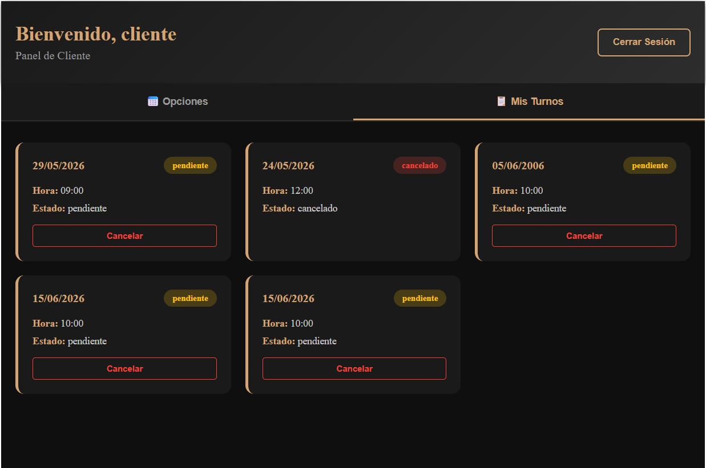
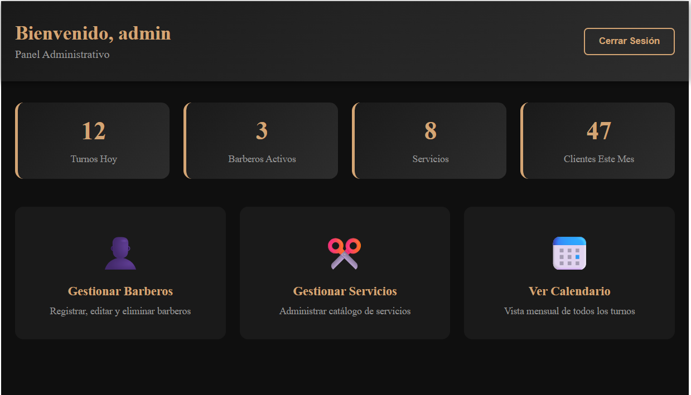

# 💈 JMS Barber Shop - Sistema de Gestión de Turnos (Frontend)

> **Versión**: 1.0.0  
> **Última actualización**: 2026-05-31  


---

## 📖 Descripción General
Frontend del sistema de gestión de turnos para barbería **"JMS Barber Shop"**. Interfaz de usuario desarrollada en **Angular 17** con diseño moderno y responsive, permitiendo a los clientes reservar turnos, a los barberos gestionar su agenda y a los administradores controlar todo el sistema.

---

## 👥 Integrantes
- **Miguel Ángel Cortázar Montoya**
- **Juan David Ojeda Díaz**
- **Juan Sebastián Padierna Manco**

---

## ⚙️ Tecnologías Utilizadas
- **Angular 17** - Framework de frontend
- **TypeScript** - Lenguaje de programación
- **SCSS** - Preprocesador de estilos
- **Angular Router** - Navegación y rutas protegidas
- **Angular Guards** - Protección de rutas por rol
- **JWT Token** - Autenticación y manejo de sesiones
- **CSS Grid/Flexbox** - Diseño responsive

---

## 🚀 Funcionalidades Implementadas
- 🔐 **Autenticación completa**: Login, logout y manejo de tokens JWT  
- 👤 **Dashboard por roles**: Cliente, Barbero y Administrador  
- 📅 **Reserva de turnos**: Selección de servicio, barbero y horario  
- 👨‍💼 **Gestión de barberos**: CRUD completo con validaciones  
- 💈 **Gestión de servicios**: Crear, editar y eliminar servicios  
- 📊 **Visualización de calendario**: Agenda de turnos por día  
- 🛡️ **Rutas protegidas**: Guardias de autenticación y autorización  
- 📱 **Diseño responsive**: Adaptable a móviles y escritorio  

---

## 📦 Requisitos de Instalación
1. **Node.js 18+**  
2. **npm** (instalado con Node.js)  
3. **Angular CLI** (opcional, se instala localmente)  

### Instalación
```bash
# Clonar repositorio
git clone https://github.com/tu-usuario/JMS-Barber-Shop.git

# Navegar al frontend
cd Frontend-JMS-Barber-Shop

# Instalar dependencias
npm install

# Instalar Angular CLI globalmente (si no está instalado)
npm install -g @angular/cli
```

---

## ▶️ Pasos para Ejecutar el Proyecto
```bash
# Iniciar servidor de desarrollo
ng serve

# O usando npm
npm start

# Una vez compilado, navegar a:
http://localhost:4200
```

### Credenciales de prueba
```
Admin:
  Email: admin@jms.com
  Contraseña: admin123

Cliente:
  Email: cliente@jms.com
  Contraseña: cliente123

Barbero:
  Email: barbero@jms.com
  Contraseña: barbero123
```

---

## 🌐 Enlace al Despliegue
- **Frontend desplegado**: *[Se conectará mediante despliegue en servidor asignado]*  
  (Actualmente en configuración local)

---

## 📸 Capturas del MVP
# Dashboard del Cliente

*Panel de cliente con lista de turnos*

# Dashboard del Administrador

*Panel de administrador con gestión de barberos y servicios*

---

## 📁 Estructura del Proyecto
```
src/
├── app/
│   ├── components/
│   │   ├── login/
│   │   ├── register/
│   │   ├── cliente-dashboard/
│   │   ├── barbero-dashboard/
│   │   ├── admin-dashboard/
│   │   ├── admin-barberos/
│   │   ├── admin-servicios/
│   │   └── admin-calendario/
│   ├── services/
│   │   ├── auth.service.ts
│   │   ├── barbero.service.ts
│   │   ├── servicio.service.ts
│   │   └── turno.service.ts
│   ├── guards/
│   │   ├── auth.guard.ts
│   │   └── role.guard.ts
│   ├── interceptors/
│   ├── models/
│   └── app.routes.ts
```

---

## 📜 Licencia
Esta aplicación está bajo licencia ITM. Puedes usarla, modificarla y distribuirla de acuerdo a los términos de la licencia.

---

## 🙏 Agradecimientos
- A **Angular** por el framework de código abierto.  
- A **TypeScript** por su tipado estático.  
- A la comunidad de **Angular** por sus recursos y ejemplos.

---

*¡Gracias por usar y contribuir al proyecto!*
ATT: Proyecto JMS Barber Shop

**Versión**: 1.0.0